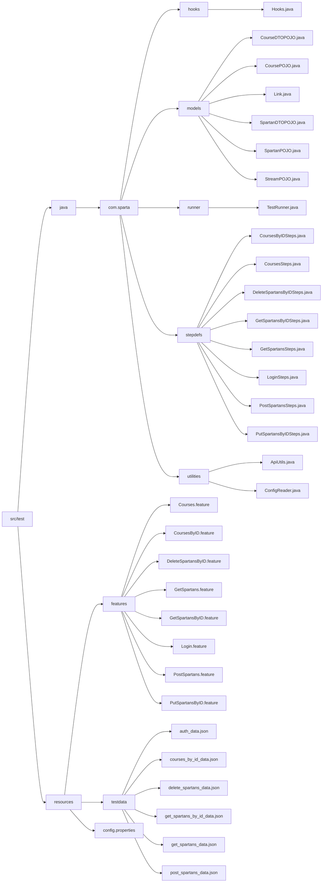
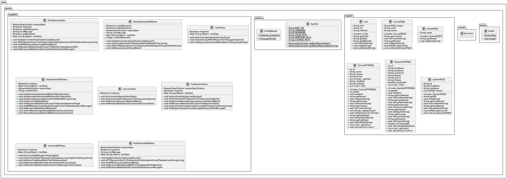

```mermaid
flowchart LR
    src[src/test] --> java & resources

    java --> com.sparta
    com.sparta --> hooks & models & runner & stepdefs & utilities

    hooks --> Hooks.java

    models --> CourseDTOPOJO.java
    models --> CoursePOJO.java
    models --> Link.java
    models --> SpartanDTOPOJO.java
    models --> SpartanPOJO.java
    models --> StreamPOJO.java

    runner --> TestRunner.java

    stepdefs --> CoursesByIDSteps.java
    stepdefs --> CoursesSteps.java
    stepdefs --> DeleteSpartansByIDSteps.java
    stepdefs --> GetSpartansByIDSteps.java
    stepdefs --> GetSpartansSteps.java
    stepdefs --> LoginSteps.java
    stepdefs --> PostSpartansSteps.java
    stepdefs --> PutSpartansByIDSteps.java

    utilities --> ApiUtils.java
    utilities --> ConfigReader.java

    resources --> features & testdata & config.properties

    features --> Courses.feature
    features --> CoursesByID.feature
    features --> DeleteSpartansByID.feature
    features --> GetSpartans.feature
    features --> GetSpartansByID.feature
    features --> Login.feature
    features --> PostSpartans.feature
    features --> PutSpartansByID.feature

    testdata --> auth_data.json
    testdata --> courses_by_id_data.json
    testdata --> delete_spartans_data.json
    testdata --> get_spartans_by_id_data.json
    testdata --> get_spartans_data.json
    testdata --> post_spartans_data.json
```

## Class Diagram

