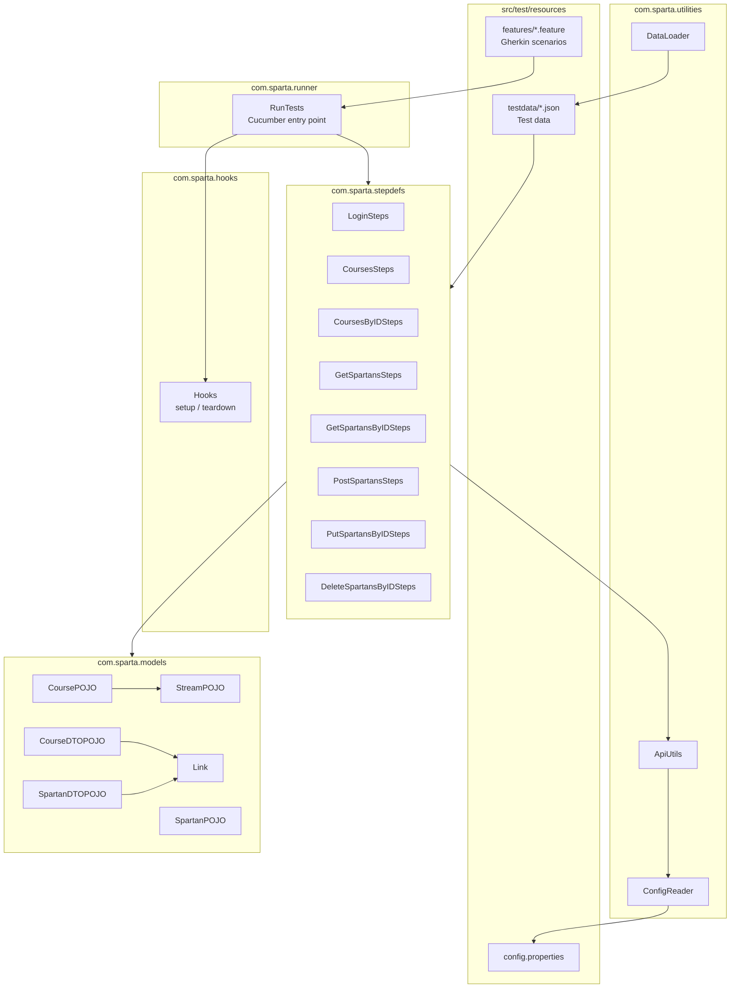

# API Test Framework — Sparta Academy App
 
An automated API testing framework for the Sparta Academy App (SUT), built with **Cucumber**, **RestAssured**, and **JUnit**, following BDD principles. The framework verifies the documented RESTful endpoints (`/Auth`, `/Spartans`, `/Courses`) for happy paths, sad paths, and edge cases, and includes a unit-tested utilities layer with Mockito.
 
## Table of contents
 
- [Framework architecture](#framework-architecture)
- [Prerequisites](#prerequisites)
- [Setup instructions](#setup-instructions)
- [User guide — running the tests](#user-guide--running-the-tests)
- [Test reports](#test-reports)
- [CI pipeline](#ci-pipeline)
- [Project structure](#project-structure)
- [Contribution guidelines](#contribution-guidelines)


## Framework architecture
The framework follows a layered BDD structure: Gherkin feature files describe behaviour, step definitions translate those steps into API calls via RestAssured, and shared utilities handle configuration and test data.



## Class Diagram


**How it fits together:**
 
1. **Runner** (`RunTests`) kicks off Cucumber, which discovers `.feature` files and binds Gherkin steps to Java methods.
2. **Hooks** manage setup and teardown around each scenario (e.g. authentication, resetting state).
3. **Step definitions** implement the Gherkin steps — each maps to an endpoint area (Login, Courses, Spartans CRUD) and calls into `ApiUtils` to make RestAssured requests.
4. **Utilities** centralise cross-cutting logic: `ConfigReader` reads environment config, `ApiUtils` builds and sends requests/assertions, `DataLoader` reads parametrised test data from JSON.
5. **Models (POJOs/DTOs)** deserialise API responses for assertions and serialise request bodies for POST/PUT calls.
6. **Test data and config** are kept external to the test logic — JSON files under `resources/testdata` and a local `config.properties` file (see [Setup instructions](#setup-instructions)) — so scenarios are data-driven and environment-portable.

This separation means a new endpoint can be tested by adding a feature file, a step definitions class, and (if needed) a POJO — without touching the runner, hooks, or other step files.
## Prerequisites
 
| Tool | Purpose |
|---|---|
| [Docker](https://www.docker.com/) | Runs the System Under Test (SUT) |
| [Java 11+ / 17+ JDK](https://adoptium.net/) | Compiles and runs the framework |
| [Maven](https://maven.apache.org/) | Dependency management and build |
| [IntelliJ IDEA](https://www.jetbrains.com/idea/) (recommended) | IDE with Cucumber + Maven support |
| [Postman](https://www.postman.com/) | Exploratory/manual testing of the SUT |
| Git | Version control |

## Setup instructions
 
1. **Download and run the SUT**
   Download the Docker image (link provided in the project brief) and follow the README in that package to start the container. Confirm it's running and Swagger docs are reachable, e.g. at `http://localhost:8080/swagger-ui.html` (check the SUT's own docs for the exact path).
2. **Clone this repository**
```bash
   git clone <https://github.com/MehmetAvcil/API-TESTING-PERSONAL/>
   cd <https://github.com/MehmetAvcil/API-TESTING-PERSONAL/>
```
 
3. **Create your local config file**
   `config.properties` is git-ignored (it's environment-specific and may contain credentials), so it is **not** included in the repo. Create it yourself at:
```
   src/test/resources/config.properties
```
   using this template:
```
   base.uri=
   username=
   password=
   login.path=/Auth/login
   spartans.path=/Spartans
   courses.path=/Courses
```
   Adjust `base.uri` and credentials to match your local SUT instance.

4. **Open in IntelliJ**
   - `File → Open` and select the project root (Maven project — IntelliJ should auto-detect `pom.xml` and import dependencies).
   - Install the **Cucumber for Java** and **Gherkin** plugins via `Settings → Plugins` if not already installed, for syntax highlighting and step navigation in `.feature` files.
5. **Verify the build**
```bash
   mvn clean install
```

## User guide — running the tests

### Running the API test suite (Cucumber)

Surefire is configured to run `RunTests` by default, so the plain Maven command triggers the full Cucumber suite:

```bash
mvn test
```

In IntelliJ: navigate to `src/test/java/com/sparta/runner/RunTests.java`, right-click → **Run 'RunTests'**. Alternatively, right-click any individual `.feature` file under `src/test/resources/features` → **Run Feature** to execute just that scenario set.

> Make sure the SUT container is running first — tests will fail to connect otherwise.

Run a specific tag (if scenarios are tagged, e.g. `@smoke`, `@regression`):
```bash
mvn test -Dcucumber.filter.tags="@smoke"
```

### Running the unit tests

Unit tests are **not** picked up by a plain `mvn test` (Surefire is scoped to `RunTests` only). Run them explicitly by class name:

```bash
mvn test -Dtest=ApiUtilsTest,ConfigReaderTest,DataLoaderTest
```

In IntelliJ: right-click the `utilities` package (or an individual `*Test.java` file) under `src/test/java/com/sparta/utilities` → **Run Tests**.

 
## Test reports
 
**API test suite (Cucumber):** generates HTML and JSON reports after each **local** run, summarising pass/fail status per scenario and step.
 
- **Location:** `target/cucumber-reports/` (generated after running `RunTests` locally — see [User guide](#user-guide--running-the-tests))
- Open the HTML report in any browser for a readable breakdown of passed, failed, and skipped scenarios.
**Unit tests (JUnit/Mockito):** run both locally and in CI, reported via Surefire to `target/surefire-reports/`.
 
- Locally, this folder persists on disk and can be opened directly.
- **In CI**, this folder is written to the runner's filesystem but is discarded when the job ends — it is **not** visible anywhere unless the workflow explicitly uploads it (e.g. via `actions/upload-artifact`) or publishes it as a check (e.g. via a test-reporter action). Check `.github/workflows/` to confirm whether this step exists; if not, only pass/fail status is visible in the Actions log, not the report itself.
**Code coverage:** measured with **JaCoCo**, reported under `target/site/jacoco/index.html` after running `mvn test` (with the JaCoCo Maven plugin configured in `pom.xml`). As with Surefire output, this is local-only unless the CI workflow uploads it as an artifact.

## CI pipeline

GitHub Actions automates the build and **unit test** cycle (the Cucumber/API test suite is not run in CI, since it requires the SUT container to be running, and Surefire is scoped to `RunTests` rather than the unit test classes):

- **On every pull request**, the pipeline checks out the code, sets up the JDK, and runs the unit tests explicitly by class name — the same command used locally:
```bash
  mvn test -Dtest=ApiUtilsTest,ConfigReaderTest,DataLoaderTest
```
- **If all unit tests pass**, the pipeline automatically merges the pull request; if any test fails, the merge is blocked so broken code can't reach the main branch.
- The Cucumber API test suite (`mvn test`, which runs `RunTests` by default) is run manually/locally against a running SUT instance (see [User guide](#user-guide--running-the-tests)) and is not part of this pipeline.
- Workflow file: `.github/workflows/` — see the YAML file in that directory for the exact steps, triggers, and merge condition configured for this repository.

## Project structure
 
```
src/
├── test/
│   ├── java/com/sparta/
│   │   ├── runner/        # Cucumber test entry point
│   │   ├── hooks/         # Scenario setup/teardown
│   │   ├── stepdefs/      # Gherkin step definitions (one class per feature area)
│   │   ├── utilities/     # ApiUtils, ConfigReader, DataLoader (+ their unit tests)
│   │   └── models/        # Request/response POJOs and DTOs
│   └── resources/
│       ├── features/      # Gherkin .feature files
│       ├── testdata/      # JSON test data for parametrised scenarios
│       └── config.properties   # Local config (git-ignored — create from template above)
```
 
## Contribution guidelines

Contributions from other testers/developers should follow this workflow:

1. **Branch from `main`** using a descriptive name, e.g. `feature/courses-by-id-edge-cases` or `fix/login-401-assertion`.
2. **Write Gherkin first.** Add or update the relevant `.feature` file before writing step definitions, so the scenario's intent is clear and reviewable on its own.
3. **Keep step definitions thin.** Business/API logic belongs in `utilities` (e.g. `ApiUtils`), not inlined in step methods — this keeps steps readable and logic unit-testable.
4. **Add test data externally.** New parametrised cases go into the relevant JSON file under `resources/testdata`, not hardcoded into step definitions.
5. **Write unit tests for any new logic**, using Mockito to mock dependencies (e.g. HTTP calls, file reads), and ensure they pass locally before pushing.
6. **Run the unit tests locally before pushing** (`mvn test -Dtest=ApiUtilsTest,ConfigReaderTest,DataLoaderTest`, adding your new test class to the list) — this is what CI will run, so confirm it passes locally first. If your change also affects API behaviour, run the Cucumber suite (`mvn test`) against a running SUT instance too.
7. **Open a pull request into `main`.** The CI pipeline will run automatically; a passing build is required before merge.
8. **Log defects, don't silently skip them.** If a scenario reveals a bug in the SUT rather than the framework, raise a defect report (steps to reproduce, severity, status) rather than disabling or deleting the test.
9. **Never commit `config.properties`** or any file containing credentials — it's git-ignored intentionally; use the template in [Setup instructions](#setup-instructions).
